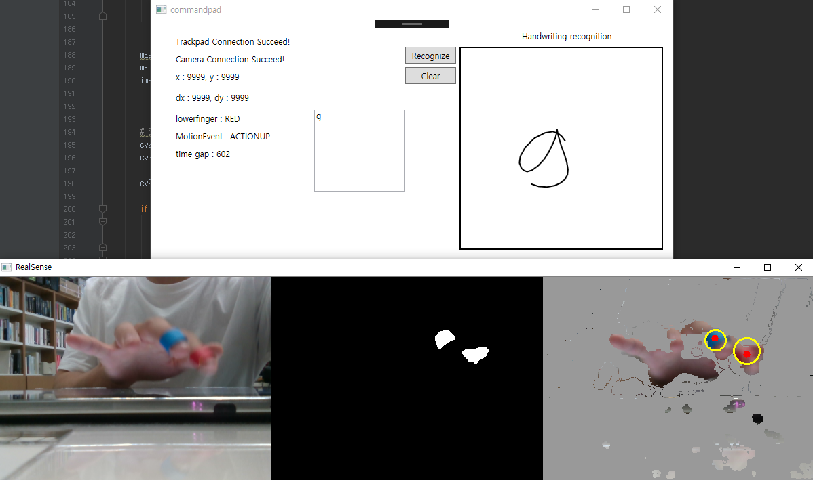

## CommandPad: Using Finger Identification for Seamless Mode Switching of Command Gesture and Cursor Manipulation on Touchpad
<h4 align="center">
 (Personal Research Project, 2019)
</h4>

    

## Basic Idea
* Use an index finger for triggering command by drawing alphabetic gesture stroke (e.g., "g" shown in above image)
* Use a middle finger for cursor manipulation as in the original touchpad usage.
* Use colored finger strap (e.g., red and blue as shown in above image) to identify the touched finger.

## System Component
* C#
  * Cursor Manipulation of main PC
  * Handwriting (Gesture) Recognition: [Microsoft.Ink API](https://docs.microsoft.com/en-us/dotnet/desktop/wpf/advanced/handwriting-recognition?view=netframeworkdesktop-4.8)
* Android
  * Trackpad Simulation
  * Send touch information to main PC (through TCP networking)
* Python
  * Finger Identification (Using Depth Camera: [Intel Realsense D415](https://www.intelrealsense.com/depth-camera-d415/))
  * OpenCV image processing
  * Depth Clipping (To ignore noises from background colors)

